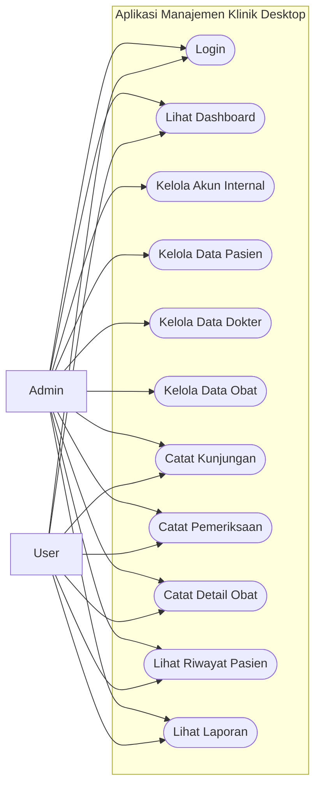
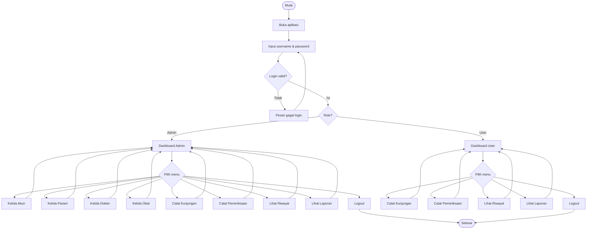
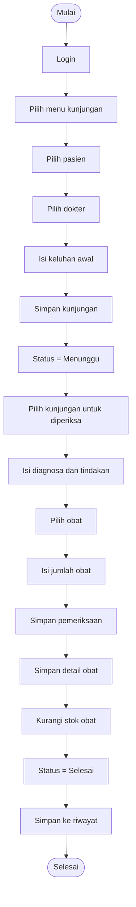
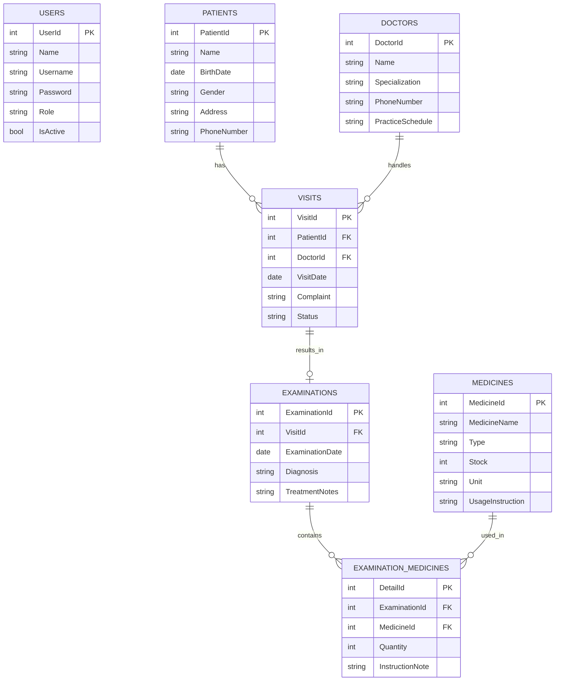
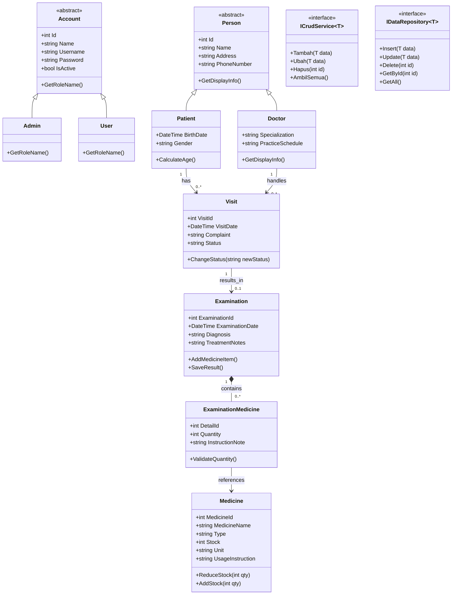
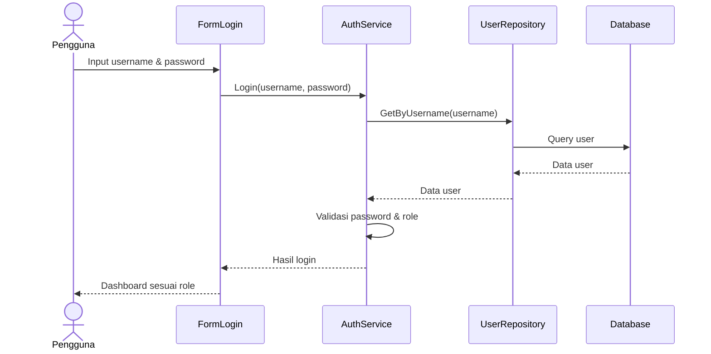
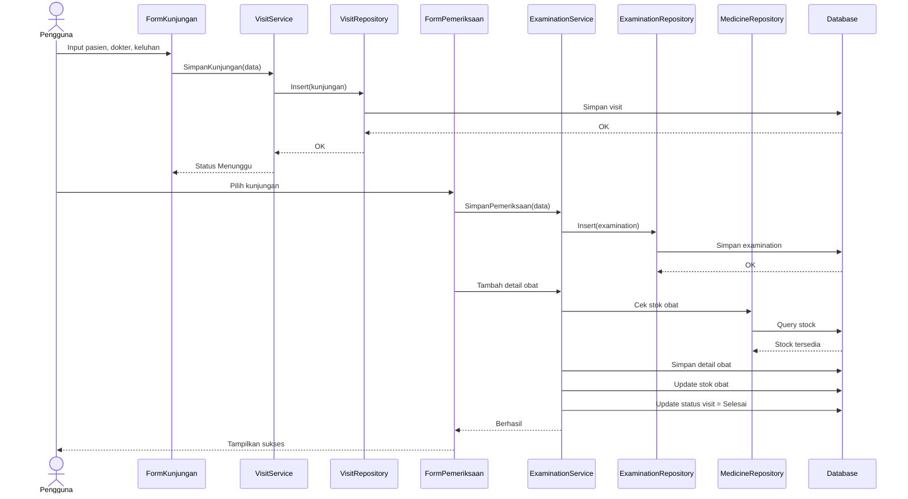

# PRD — Aplikasi Manajemen Klinik Desktop  
## Versi Internal Klinik dengan Role **Admin** dan **User**

> Dokumen ini disusun untuk kebutuhan tugas kelompok mata kuliah **Pemrograman Berorientasi Objek**.  
> Aplikasi dirancang untuk **internal klinik**, berbasis **desktop**, dikembangkan dengan **Visual Studio + C#**, dan ditujukan agar **fiturnya lengkap, saling terhubung, serta seluruh alurnya bisa berjalan** secara logis.

---

# 1. Identitas Produk

**Nama Aplikasi:** KlinikSehat Desktop  
**Jenis Aplikasi:** Desktop Application  
**Platform:** Windows  
**Bahasa Pemrograman:** C#  
**IDE:** Visual Studio  
**UI yang Disarankan:** Windows Forms  
**Database yang Disarankan:** SQL Server LocalDB / SQLite  
**Target Pengguna:** Staf internal klinik  
**Jumlah Role:** 2 role login
- **Admin**
- **User**

---

# 2. Ringkasan Produk

KlinikSehat Desktop adalah aplikasi manajemen klinik sederhana namun lengkap yang digunakan untuk membantu operasional internal klinik, meliputi:

- login dan manajemen akun internal,
- pengelolaan data pasien,
- pengelolaan data dokter,
- pengelolaan data obat,
- pencatatan pendaftaran atau kunjungan pasien,
- pencatatan hasil pemeriksaan,
- pencatatan obat yang diberikan,
- penelusuran riwayat pasien,
- monitoring ringkas melalui dashboard.

Aplikasi ini dibuat agar:
1. **cukup lengkap** untuk terlihat serius saat presentasi,
2. **tetap realistis** untuk dikerjakan oleh tim kecil,
3. sangat cocok untuk menunjukkan penerapan **Object-Oriented Programming (OOP)**.

---

# 3. Latar Belakang

Dalam operasional klinik kecil, data pasien, dokter, dan pemeriksaan sering masih dicatat secara manual atau tersebar di banyak file. Hal ini menyebabkan:

- pencarian data pasien lambat,
- riwayat kunjungan sulit dilacak,
- data pemeriksaan tidak terstruktur,
- stok dan penggunaan obat sulit dipantau,
- rawan salah input dan duplikasi data.

Melalui aplikasi desktop ini, seluruh proses inti klinik dapat dicatat dalam satu sistem yang rapi dan saling terhubung.

---

# 4. Tujuan Produk

## 4.1 Tujuan Utama
- Membantu staf klinik mengelola data operasional secara digital.
- Memudahkan pencarian pasien dan riwayat kunjungan.
- Menyatukan alur pendaftaran, pemeriksaan, dan pemberian obat dalam satu sistem.
- Membuat sistem yang cukup lengkap tetapi masih bisa selesai dikerjakan untuk tugas kuliah.

## 4.2 Tujuan Akademik
Aplikasi ini juga dibuat untuk menunjukkan penerapan konsep:
- **Encapsulation**
- **Inheritance**
- **Polymorphism**
- **Abstraction**
- **Association**
- **Composition**

---

# 5. Role Pengguna

## 5.1 Admin
Admin adalah pengguna dengan akses penuh.

### Hak Akses Admin
- login
- melihat dashboard
- mengelola akun internal
- menambah, mengubah, menghapus data pasien
- menambah, mengubah, menghapus data dokter
- menambah, mengubah, menghapus data obat
- mencatat kunjungan pasien
- mencatat pemeriksaan pasien
- mencatat obat yang diberikan
- melihat seluruh riwayat pasien
- melihat laporan sederhana

---

## 5.2 User
User adalah staf internal klinik dengan akses operasional harian.

### Hak Akses User
- login
- melihat dashboard
- melihat dan mencari data pasien
- melihat data dokter
- melihat data obat
- mencatat kunjungan pasien
- mencatat pemeriksaan pasien
- mencatat obat yang diberikan
- melihat riwayat pasien

### Batasan User
- tidak dapat menghapus data master
- tidak dapat mengelola akun internal
- tidak dapat mengubah seluruh konfigurasi sistem

---

# 6. Matriks Hak Akses

| Fitur | Admin | User |
|---|---|---|
| Login | Ya | Ya |
| Dashboard | Ya | Ya |
| Kelola Akun Internal | Ya | Tidak |
| Tambah Pasien | Ya | Tidak |
| Edit Pasien | Ya | Tidak |
| Hapus Pasien | Ya | Tidak |
| Lihat / Cari Pasien | Ya | Ya |
| Tambah Dokter | Ya | Tidak |
| Edit Dokter | Ya | Tidak |
| Hapus Dokter | Ya | Tidak |
| Lihat Dokter | Ya | Ya |
| Tambah Obat | Ya | Tidak |
| Edit Obat | Ya | Tidak |
| Hapus Obat | Ya | Tidak |
| Lihat Obat | Ya | Ya |
| Catat Kunjungan | Ya | Ya |
| Catat Pemeriksaan | Ya | Ya |
| Catat Obat yang Diberikan | Ya | Ya |
| Lihat Riwayat Pasien | Ya | Ya |
| Laporan Ringkas | Ya | Ya |

---

# 7. Ruang Lingkup Sistem

## 7.1 Yang Termasuk
1. Login dan otorisasi role
2. Dashboard
3. Manajemen akun internal
4. Manajemen data pasien
5. Manajemen data dokter
6. Manajemen data obat
7. Pendaftaran / kunjungan pasien
8. Pemeriksaan pasien
9. Detail obat yang diberikan saat pemeriksaan
10. Riwayat pasien
11. Laporan sederhana berbasis data yang sudah ada

## 7.2 Yang Tidak Termasuk
1. Sistem pembayaran
2. Integrasi BPJS
3. Integrasi laboratorium
4. Integrasi WhatsApp / SMS
5. Multi-cabang klinik
6. Sistem web dan mobile
7. Sinkronisasi cloud
8. Rekam medis tingkat rumah sakit
9. Tanda tangan digital dokter

> Fokus sistem adalah **operasional inti klinik**.  
> Dengan batasan ini, fitur tetap lengkap dan saling terhubung, tetapi tidak melebar ke area yang terlalu kompleks.

---

# 8. Fitur Utama Sistem

## 8.1 Login dan Otorisasi
Fitur untuk autentikasi pengguna internal.

### Fungsi
- validasi username dan password
- membedakan role Admin dan User
- menampilkan menu sesuai hak akses

---

## 8.2 Dashboard
Menampilkan ringkasan data utama.

### Informasi Dashboard
- jumlah pasien
- jumlah dokter
- jumlah obat
- jumlah kunjungan hari ini
- jumlah pemeriksaan selesai
- jumlah kunjungan menunggu

---

## 8.3 Manajemen Akun Internal
Digunakan khusus oleh Admin untuk mengelola akun petugas klinik.

### Data Akun
- ID User
- Nama
- Username
- Password
- Role
- Status aktif / nonaktif

---

## 8.4 Manajemen Data Pasien
Digunakan untuk menyimpan data pasien.

### Fungsi
- tambah pasien
- edit pasien
- hapus pasien
- cari pasien
- lihat detail pasien

### Data Pasien
- ID Pasien
- Nama
- Tanggal Lahir
- Jenis Kelamin
- Alamat
- No. Telepon

---

## 8.5 Manajemen Data Dokter
Digunakan untuk menyimpan data dokter yang menangani pasien.

### Fungsi
- tambah dokter
- edit dokter
- hapus dokter
- cari dokter
- lihat detail dokter

### Data Dokter
- ID Dokter
- Nama Dokter
- Spesialisasi
- No. Telepon
- Jadwal Praktik Sederhana

---

## 8.6 Manajemen Data Obat
Digunakan untuk menyimpan data obat klinik.

### Fungsi
- tambah obat
- edit obat
- hapus obat
- cari obat
- lihat stok

### Data Obat
- ID Obat
- Nama Obat
- Jenis
- Stok
- Satuan
- Aturan Pakai

---

## 8.7 Pendaftaran / Kunjungan Pasien
Digunakan ketika pasien datang ke klinik.

### Fungsi
- memilih pasien
- memilih dokter
- mencatat tanggal kunjungan
- mencatat keluhan awal
- menyimpan status kunjungan

### Data Kunjungan
- ID Kunjungan
- Pasien
- Dokter
- Tanggal Kunjungan
- Keluhan Awal
- Status

### Status Kunjungan
- Menunggu
- Diperiksa
- Selesai

---

## 8.8 Pemeriksaan Pasien
Digunakan untuk mencatat hasil pemeriksaan pasien.

### Fungsi
- memilih kunjungan
- mencatat diagnosa
- mencatat tindakan atau catatan
- menyimpan hasil pemeriksaan
- mengubah status kunjungan

### Data Pemeriksaan
- ID Pemeriksaan
- Kunjungan
- Tanggal Pemeriksaan
- Diagnosa
- Tindakan / Catatan

---

## 8.9 Detail Obat pada Pemeriksaan
Digunakan untuk mencatat obat apa saja yang diberikan kepada pasien saat pemeriksaan.

### Fungsi
- memilih obat
- menentukan jumlah obat
- menghubungkan obat dengan pemeriksaan
- mengurangi stok obat otomatis

### Data Detail Obat
- ID Detail
- Pemeriksaan
- Obat
- Jumlah
- Keterangan aturan pakai

---

## 8.10 Riwayat Pasien
Digunakan untuk melihat seluruh riwayat kunjungan dan pemeriksaan pasien.

### Informasi yang Ditampilkan
- data pasien
- daftar kunjungan
- dokter yang menangani
- diagnosa
- tindakan
- daftar obat yang diberikan

---

## 8.11 Laporan Sederhana
Laporan yang ditampilkan langsung di aplikasi.

### Bentuk Laporan
- daftar kunjungan per hari
- daftar pemeriksaan selesai
- daftar pasien yang paling sering berkunjung
- stok obat yang hampir habis

> Laporan cukup berupa tampilan tabel/filter sederhana, tidak harus PDF.

---

# 9. Alur Besar Sistem

1. Pengguna membuka aplikasi
2. Pengguna login
3. Sistem membaca role
4. Dashboard tampil sesuai hak akses
5. Pengguna mengelola data master atau operasional
6. Pasien didaftarkan
7. Pemeriksaan dicatat
8. Obat yang diberikan dicatat
9. Riwayat pasien terbentuk otomatis
10. Data dapat ditampilkan kembali di dashboard dan laporan

---

# 10. Alur Operasional Detail

## 10.1 Alur Pasien Baru
1. Admin login
2. Admin membuka menu pasien
3. Admin mengisi data pasien
4. Sistem memvalidasi
5. Sistem menyimpan pasien
6. Data pasien bisa dipakai pada pendaftaran kunjungan

---

## 10.2 Alur Kunjungan Pasien
1. Pengguna login
2. Pengguna membuka menu kunjungan
3. Pengguna memilih pasien
4. Pengguna memilih dokter
5. Pengguna menulis keluhan awal
6. Sistem menyimpan kunjungan
7. Status awal menjadi **Menunggu**

---

## 10.3 Alur Pemeriksaan
1. Pengguna membuka daftar kunjungan
2. Pengguna memilih kunjungan dengan status Menunggu
3. Pengguna mengisi diagnosa
4. Pengguna mengisi tindakan atau catatan
5. Pengguna memilih obat yang diberikan
6. Sistem menyimpan pemeriksaan
7. Sistem menyimpan detail obat
8. Sistem mengurangi stok obat
9. Status kunjungan berubah menjadi **Selesai**

---

## 10.4 Alur Riwayat Pasien
1. Pengguna membuka menu riwayat
2. Pengguna mencari pasien
3. Sistem menampilkan daftar kunjungan pasien
4. Pengguna memilih salah satu riwayat
5. Sistem menampilkan detail pemeriksaan dan obat

---

# 11. Diagram Use Case



---

# 12. Diagram Alur Sistem



---

# 13. Diagram Aktivitas Pendaftaran sampai Obat



---

# 14. Kebutuhan Fungsional

## 14.1 Modul Login
- Sistem harus menerima input username dan password.
- Sistem harus memvalidasi akun internal.
- Sistem harus mengenali role admin atau user.
- Sistem harus menampilkan menu sesuai role.

## 14.2 Modul Akun Internal
- Sistem harus bisa menambah akun internal.
- Sistem harus bisa mengubah akun internal.
- Sistem harus bisa menghapus akun internal.
- Sistem harus bisa menonaktifkan akun.
- Modul ini hanya dapat diakses admin.

## 14.3 Modul Pasien
- Sistem harus bisa menambah pasien.
- Sistem harus bisa mengubah pasien.
- Sistem harus bisa menghapus pasien.
- Sistem harus bisa mencari pasien.
- Sistem harus bisa menampilkan detail pasien.

## 14.4 Modul Dokter
- Sistem harus bisa menambah dokter.
- Sistem harus bisa mengubah dokter.
- Sistem harus bisa menghapus dokter.
- Sistem harus bisa mencari dokter.
- Sistem harus bisa menampilkan detail dokter.

## 14.5 Modul Obat
- Sistem harus bisa menambah obat.
- Sistem harus bisa mengubah obat.
- Sistem harus bisa menghapus obat.
- Sistem harus bisa mencari obat.
- Sistem harus bisa menampilkan stok obat.

## 14.6 Modul Kunjungan
- Sistem harus bisa membuat kunjungan baru.
- Sistem harus bisa memilih pasien dan dokter.
- Sistem harus bisa menyimpan keluhan awal.
- Sistem harus bisa menyimpan status kunjungan.

## 14.7 Modul Pemeriksaan
- Sistem harus bisa memilih data kunjungan.
- Sistem harus bisa mencatat diagnosa.
- Sistem harus bisa mencatat tindakan atau catatan.
- Sistem harus bisa menyimpan tanggal pemeriksaan.
- Sistem harus bisa mengubah status kunjungan.

## 14.8 Modul Detail Obat
- Sistem harus bisa mengaitkan obat dengan pemeriksaan.
- Sistem harus bisa menyimpan jumlah obat yang diberikan.
- Sistem harus bisa memvalidasi stok obat.
- Sistem harus bisa mengurangi stok obat.

## 14.9 Modul Riwayat
- Sistem harus bisa menampilkan riwayat pasien.
- Sistem harus bisa menampilkan detail pemeriksaan.
- Sistem harus bisa menampilkan daftar obat yang pernah diberikan.

## 14.10 Modul Laporan
- Sistem harus bisa menampilkan kunjungan harian.
- Sistem harus bisa menampilkan pemeriksaan selesai.
- Sistem harus bisa menampilkan data stok obat rendah.
- Sistem harus bisa menampilkan total kunjungan per periode sederhana.

---

# 15. Kebutuhan Non-Fungsional

- Aplikasi berjalan pada Windows.
- Data disimpan secara lokal.
- UI sederhana dan mudah dipahami.
- Proses CRUD dan pencarian harus cepat.
- Struktur program harus mudah dibagi ke beberapa anggota.
- Relasi database harus konsisten.
- Role-based access harus berjalan.
- Validasi data harus mencegah input tidak valid.

---

# 16. Aturan Bisnis

1. Hanya pengguna internal yang memiliki akun yang bisa login.
2. Setiap akun harus memiliki role Admin atau User.
3. Admin memiliki hak akses penuh.
4. User hanya memiliki akses operasional.
5. Kunjungan hanya bisa dibuat jika pasien dan dokter sudah dipilih.
6. Pemeriksaan hanya bisa dibuat jika data kunjungan sudah ada.
7. Detail obat hanya bisa ditambahkan jika data pemeriksaan sudah ada.
8. Jumlah obat yang diberikan tidak boleh melebihi stok.
9. Saat detail obat disimpan, stok obat harus berkurang.
10. Riwayat pasien terbentuk dari kunjungan yang telah memiliki pemeriksaan.
11. Satu pasien dapat memiliki banyak kunjungan.
12. Satu dokter dapat menangani banyak kunjungan.
13. Satu pemeriksaan dapat memiliki banyak item obat.

---

# 17. Validasi Data

- username tidak boleh kosong
- password tidak boleh kosong
- nama pasien tidak boleh kosong
- tanggal lahir pasien harus valid
- nama dokter tidak boleh kosong
- nama obat tidak boleh kosong
- stok obat tidak boleh negatif
- pasien dan dokter wajib dipilih saat membuat kunjungan
- diagnosa tidak boleh kosong saat menyimpan pemeriksaan
- jumlah obat harus lebih dari 0
- jumlah obat tidak boleh lebih besar dari stok tersedia

---

# 18. Use Case Specification

## 18.1 Use Case — Login

| Elemen | Deskripsi |
|---|---|
| Nama | Login |
| Aktor | Admin, User |
| Tujuan | Masuk ke dalam sistem |
| Prasyarat | Memiliki akun aktif |
| Alur Utama | 1. Pengguna membuka aplikasi. 2. Mengisi username dan password. 3. Sistem memvalidasi data. 4. Sistem menampilkan dashboard sesuai role. |
| Alur Alternatif | Jika username/password salah, sistem menampilkan pesan gagal login. |
| Hasil | Pengguna berhasil masuk ke sistem |

---

## 18.2 Use Case — Kelola Pasien

| Elemen | Deskripsi |
|---|---|
| Nama | Kelola Pasien |
| Aktor | Admin |
| Tujuan | Mengelola data pasien |
| Prasyarat | Admin sudah login |
| Alur Utama | 1. Admin membuka menu pasien. 2. Admin menambah, mengubah, atau menghapus data. 3. Sistem menyimpan perubahan. |
| Hasil | Data pasien tersimpan atau diperbarui |

---

## 18.3 Use Case — Catat Kunjungan

| Elemen | Deskripsi |
|---|---|
| Nama | Catat Kunjungan |
| Aktor | Admin, User |
| Tujuan | Mendaftarkan pasien yang datang ke klinik |
| Prasyarat | Data pasien dan dokter tersedia |
| Alur Utama | 1. Pengguna membuka menu kunjungan. 2. Memilih pasien. 3. Memilih dokter. 4. Mengisi keluhan awal. 5. Sistem menyimpan kunjungan. |
| Hasil | Kunjungan tersimpan dengan status Menunggu |

---

## 18.4 Use Case — Catat Pemeriksaan

| Elemen | Deskripsi |
|---|---|
| Nama | Catat Pemeriksaan |
| Aktor | Admin, User |
| Tujuan | Menyimpan hasil pemeriksaan pasien |
| Prasyarat | Data kunjungan tersedia |
| Alur Utama | 1. Pengguna memilih kunjungan. 2. Mengisi diagnosa dan tindakan. 3. Menyimpan pemeriksaan. |
| Hasil | Data pemeriksaan tersimpan |

---

## 18.5 Use Case — Catat Obat yang Diberikan

| Elemen | Deskripsi |
|---|---|
| Nama | Catat Detail Obat |
| Aktor | Admin, User |
| Tujuan | Menyimpan obat yang diberikan kepada pasien |
| Prasyarat | Pemeriksaan sudah ada dan stok tersedia |
| Alur Utama | 1. Pengguna memilih obat. 2. Mengisi jumlah. 3. Sistem memvalidasi stok. 4. Sistem menyimpan detail obat dan mengurangi stok. |
| Hasil | Data obat tersimpan pada pemeriksaan |

---

## 18.6 Use Case — Lihat Riwayat Pasien

| Elemen | Deskripsi |
|---|---|
| Nama | Lihat Riwayat Pasien |
| Aktor | Admin, User |
| Tujuan | Menampilkan riwayat kunjungan dan pemeriksaan pasien |
| Prasyarat | Data pasien dan pemeriksaan tersedia |
| Alur Utama | 1. Pengguna mencari pasien. 2. Sistem menampilkan daftar riwayat. 3. Pengguna membuka detail. |
| Hasil | Riwayat pasien dapat dilihat |

---

# 19. Desain Database  
## Minimal 5 tabel berelasi — versi ini memakai **7 tabel berelasi**

### Daftar Tabel
1. `users`
2. `patients`
3. `doctors`
4. `medicines`
5. `visits`
6. `examinations`
7. `examination_medicines`

> Dengan 7 tabel ini, seluruh fitur inti bisa berjalan saling terhubung.

---

## 19.1 Tabel `users`
Menyimpan akun internal.

Kolom:
- `UserId` (PK)
- `Name`
- `Username`
- `Password`
- `Role`
- `IsActive`

---

## 19.2 Tabel `patients`
Menyimpan data pasien.

Kolom:
- `PatientId` (PK)
- `Name`
- `BirthDate`
- `Gender`
- `Address`
- `PhoneNumber`

---

## 19.3 Tabel `doctors`
Menyimpan data dokter.

Kolom:
- `DoctorId` (PK)
- `Name`
- `Specialization`
- `PhoneNumber`
- `PracticeSchedule`

---

## 19.4 Tabel `medicines`
Menyimpan data obat.

Kolom:
- `MedicineId` (PK)
- `MedicineName`
- `Type`
- `Stock`
- `Unit`
- `UsageInstruction`

---

## 19.5 Tabel `visits`
Menyimpan data kunjungan pasien.

Kolom:
- `VisitId` (PK)
- `PatientId` (FK)
- `DoctorId` (FK)
- `VisitDate`
- `Complaint`
- `Status`

---

## 19.6 Tabel `examinations`
Menyimpan hasil pemeriksaan.

Kolom:
- `ExaminationId` (PK)
- `VisitId` (FK)
- `ExaminationDate`
- `Diagnosis`
- `TreatmentNotes`

---

## 19.7 Tabel `examination_medicines`
Tabel detail/bridge antara pemeriksaan dan obat.

Kolom:
- `DetailId` (PK)
- `ExaminationId` (FK)
- `MedicineId` (FK)
- `Quantity`
- `InstructionNote`

---

# 20. ERD



---

# 21. OOP Design

Aplikasi ini sangat cocok untuk pendekatan OOP karena data di dunia nyata bisa direpresentasikan langsung menjadi object.

## 21.1 Encapsulation
Data dan aturan validasi dibungkus di dalam class.

### Contoh penerapan
- `Stock` pada class `Medicine` tidak boleh negatif
- `Status` pada class `Visit` hanya boleh berisi status tertentu
- `Quantity` pada detail obat tidak boleh nol atau negatif

---

## 21.2 Inheritance
Inheritance dipakai untuk akun internal.

### Rancangan
- `Account` sebagai parent class
- `Admin : Account`
- `User : Account`

Selain itu bisa juga digunakan:
- `Person` sebagai parent class
- `Patient : Person`
- `Doctor : Person`

Dengan pendekatan ini, atribut umum seperti nama, alamat, dan nomor telepon tidak perlu ditulis berulang.

---

## 21.3 Polymorphism
Method yang sama dapat memiliki perilaku berbeda sesuai object.

### Contoh
- `GetRoleName()` pada `Admin` mengembalikan `"Admin"`
- `GetRoleName()` pada `User` mengembalikan `"User"`

Atau method:
- `GetDisplayInfo()` pada `Patient` dan `Doctor` menghasilkan format berbeda.

---

## 21.4 Abstraction
Abstraction diterapkan melalui:
- abstract class
- interface service/repository

### Contoh
- `ICrudService<T>`
- `IReportService`
- `IDataRepository<T>`

---

## 21.5 Association
Relasi antar object:
- `Patient` memiliki banyak `Visit`
- `Doctor` menangani banyak `Visit`
- `Visit` menghasilkan satu `Examination`

---

## 21.6 Composition
`Examination` terdiri dari kumpulan `ExaminationMedicine`.

Artinya, detail obat adalah bagian penting dari pemeriksaan dan terkait langsung dengan siklus hidup pemeriksaan.

---

# 22. Daftar Class Utama

## 22.1 Account (Abstract)
Atribut:
- Id
- Name
- Username
- Password
- IsActive

Method:
- `GetRoleName()`

## 22.2 Admin : Account
Method:
- `GetRoleName()`

## 22.3 User : Account
Method:
- `GetRoleName()`

## 22.4 Person (Abstract)
Atribut:
- Id
- Name
- Address
- PhoneNumber

Method:
- `GetDisplayInfo()`

## 22.5 Patient : Person
Atribut tambahan:
- BirthDate
- Gender

Method:
- `CalculateAge()`

## 22.6 Doctor : Person
Atribut tambahan:
- Specialization
- PracticeSchedule

Method:
- `GetDisplayInfo()`

## 22.7 Medicine
Atribut:
- MedicineId
- MedicineName
- Type
- Stock
- Unit
- UsageInstruction

Method:
- `ReduceStock(int qty)`
- `AddStock(int qty)`

## 22.8 Visit
Atribut:
- VisitId
- Patient
- Doctor
- VisitDate
- Complaint
- Status

Method:
- `ChangeStatus(string newStatus)`

## 22.9 Examination
Atribut:
- ExaminationId
- Visit
- ExaminationDate
- Diagnosis
- TreatmentNotes
- List<ExaminationMedicine>

Method:
- `AddMedicineItem()`
- `SaveResult()`

## 22.10 ExaminationMedicine
Atribut:
- DetailId
- Examination
- Medicine
- Quantity
- InstructionNote

Method:
- `ValidateQuantity()`

---

# 23. Diagram Class



---

# 24. Diagram Sequence — Login



---

# 25. Diagram Sequence — Kunjungan sampai Pemeriksaan



---

# 26. Struktur Arsitektur Sederhana

```text
KlinikSehatDesktop/
├── Forms/
│   ├── FormLogin.cs
│   ├── FormDashboard.cs
│   ├── FormUsers.cs
│   ├── FormPatients.cs
│   ├── FormDoctors.cs
│   ├── FormMedicines.cs
│   ├── FormVisits.cs
│   ├── FormExaminations.cs
│   └── FormReports.cs
├── Models/
│   ├── Account.cs
│   ├── Admin.cs
│   ├── User.cs
│   ├── Person.cs
│   ├── Patient.cs
│   ├── Doctor.cs
│   ├── Medicine.cs
│   ├── Visit.cs
│   ├── Examination.cs
│   └── ExaminationMedicine.cs
├── Services/
│   ├── AuthService.cs
│   ├── UserService.cs
│   ├── PatientService.cs
│   ├── DoctorService.cs
│   ├── MedicineService.cs
│   ├── VisitService.cs
│   ├── ExaminationService.cs
│   └── ReportService.cs
├── Repositories/
│   ├── IDataRepository.cs
│   ├── UserRepository.cs
│   ├── PatientRepository.cs
│   ├── DoctorRepository.cs
│   ├── MedicineRepository.cs
│   ├── VisitRepository.cs
│   └── ExaminationRepository.cs
├── Helpers/
│   ├── DatabaseHelper.cs
│   ├── SessionHelper.cs
│   └── ValidationHelper.cs
└── Program.cs
```

---

# 27. Pembagian Tugas 4 Orang

## Anggota 1 — Login, Akun Internal, Dashboard
Fokus:
- form login
- session
- role access
- dashboard
- manajemen akun internal

Class utama:
- `Account`
- `Admin`
- `User`
- `AuthService`
- `UserService`

---

## Anggota 2 — Modul Pasien dan Dokter
Fokus:
- CRUD pasien
- CRUD dokter
- pencarian data
- validasi data

Class utama:
- `Patient`
- `Doctor`
- `PatientService`
- `DoctorService`

---

## Anggota 3 — Modul Obat dan Kunjungan
Fokus:
- CRUD obat
- pendaftaran kunjungan
- status kunjungan

Class utama:
- `Medicine`
- `Visit`
- `MedicineService`
- `VisitService`

---

## Anggota 4 — Pemeriksaan, Detail Obat, Riwayat, Laporan
Fokus:
- pemeriksaan pasien
- detail obat
- riwayat pasien
- laporan sederhana
- integrasi akhir

Class utama:
- `Examination`
- `ExaminationMedicine`
- `ExaminationService`
- `ReportService`

---

# 28. Skenario Demo Presentasi

Urutan demo yang disarankan:

1. Login sebagai **Admin**
2. Tampilkan dashboard
3. Tambah akun user
4. Tambah pasien
5. Tambah dokter
6. Tambah obat
7. Buat kunjungan pasien
8. Catat hasil pemeriksaan
9. Tambahkan obat pada pemeriksaan
10. Tunjukkan stok obat berkurang
11. Buka riwayat pasien
12. Tampilkan laporan sederhana
13. Logout
14. Login sebagai **User**
15. Tunjukkan perbedaan hak akses

> Demo ini akan terlihat lengkap karena memperlihatkan:
> login → master data → operasional → relasi → output → role access.

---

# 29. Risiko dan Solusi

## Risiko
- scope melebar terlalu jauh
- integrasi database antar anggota bentrok
- pengurangan stok obat tidak sinkron
- role access terlupa saat implementasi form

## Solusi
- tentukan struktur tabel sejak awal
- tentukan class model sebelum coding UI
- gunakan service layer agar logika bisnis tidak tersebar
- buat satu anggota sebagai integrator final
- uji fitur utama satu per satu berdasarkan alur sistem

---

# 30. Kesimpulan

KlinikSehat Desktop adalah aplikasi manajemen klinik internal yang:
- memiliki **2 role**: Admin dan User,
- mempunyai **fitur cukup lengkap** untuk operasional inti klinik,
- memakai **minimal 5 tabel berelasi** dan pada versi ini menggunakan **7 tabel berelasi**,
- sangat cocok untuk implementasi **OOP** dalam C# desktop application.

### Keunggulan dokumen ini
- alur sistem saling terhubung,
- fitur tidak berdiri sendiri,
- database mendukung seluruh proses,
- OOP bisa dijelaskan dengan jelas saat presentasi,
- realistis untuk dikembangkan di Visual Studio.

---

# 31. Rekomendasi Implementasi

Agar sistem benar-benar bisa dibangun dan “jalan semua”, urutan pengerjaan yang paling aman adalah:

1. buat database dan tabel relasi terlebih dahulu,
2. buat model class sesuai tabel,
3. buat login dan role access,
4. buat CRUD master data: pasien, dokter, obat,
5. buat modul kunjungan,
6. buat modul pemeriksaan,
7. buat modul detail obat + update stok,
8. buat riwayat dan laporan,
9. lakukan testing integrasi.

> Dengan urutan ini, tim akan lebih mudah memastikan semua fitur memang terhubung dan berfungsi.
