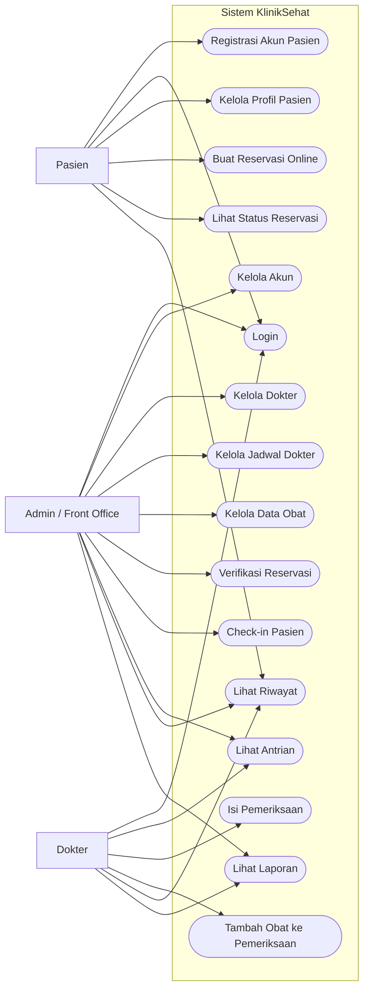
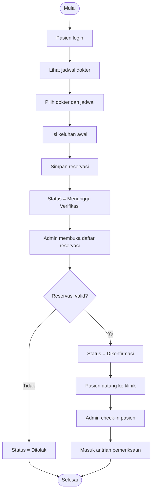
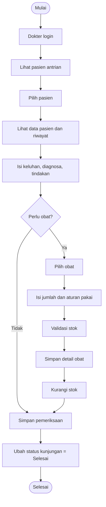
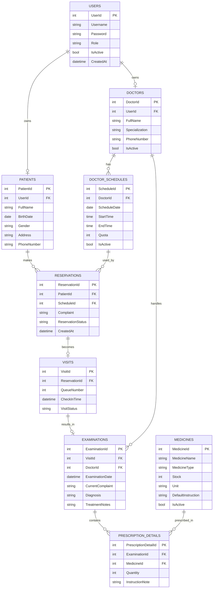
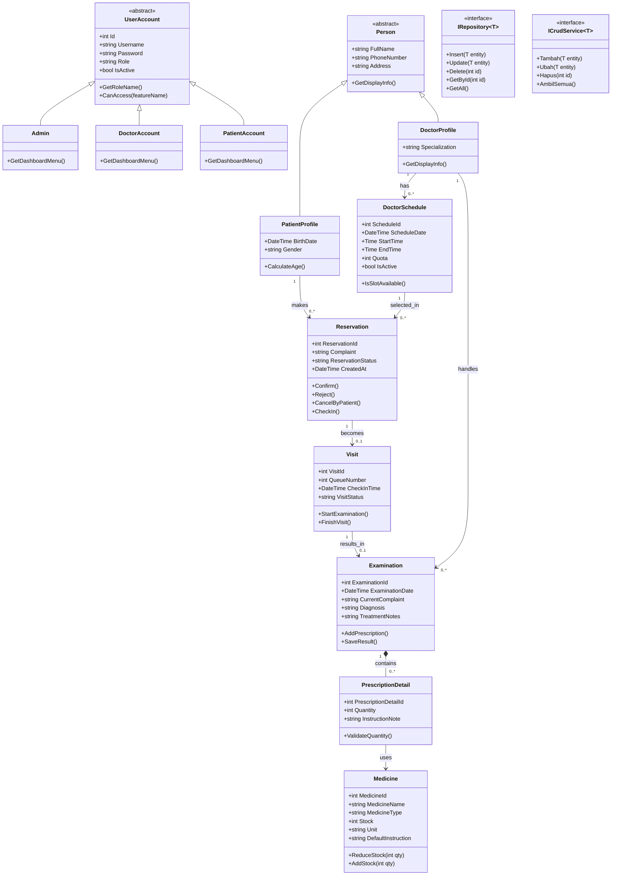
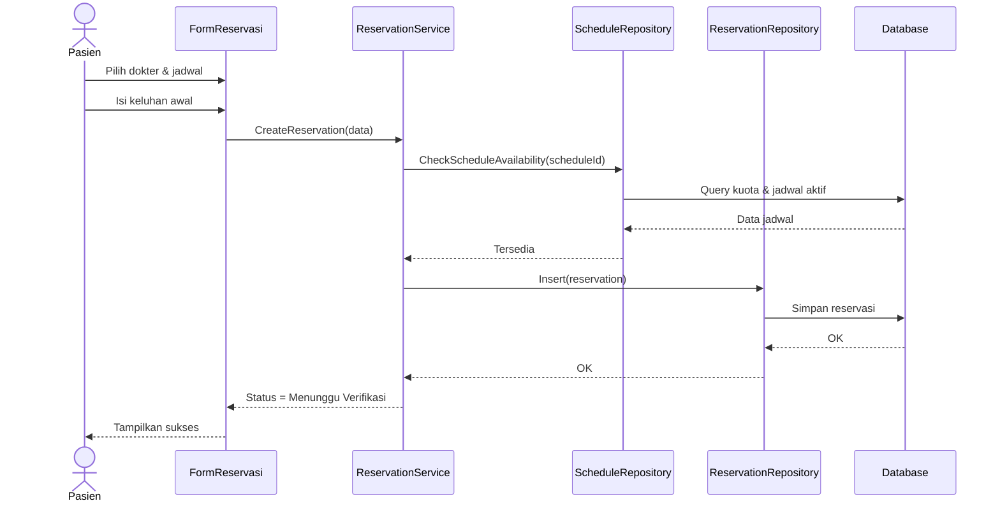
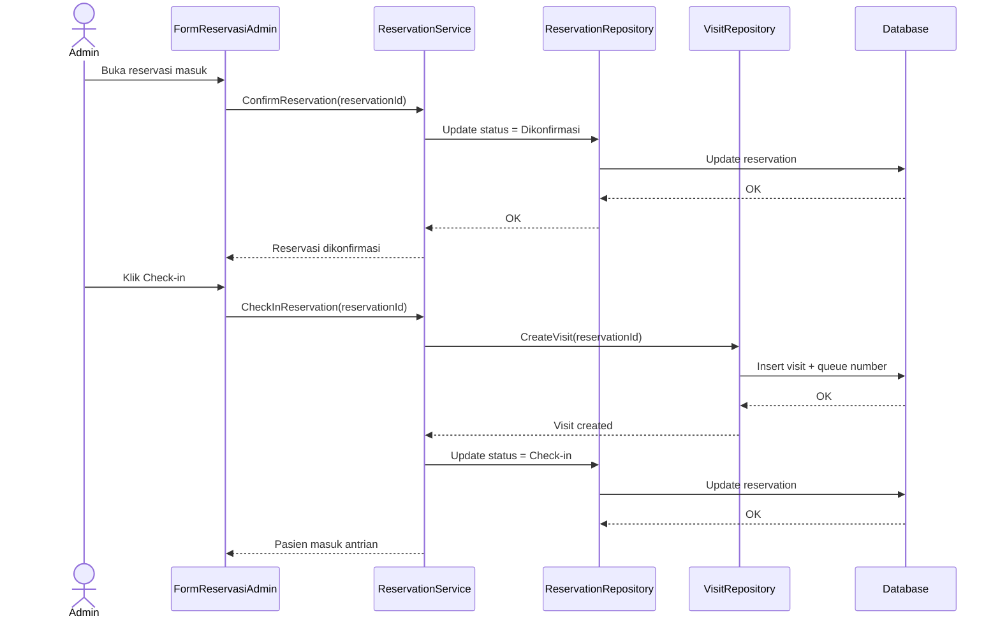
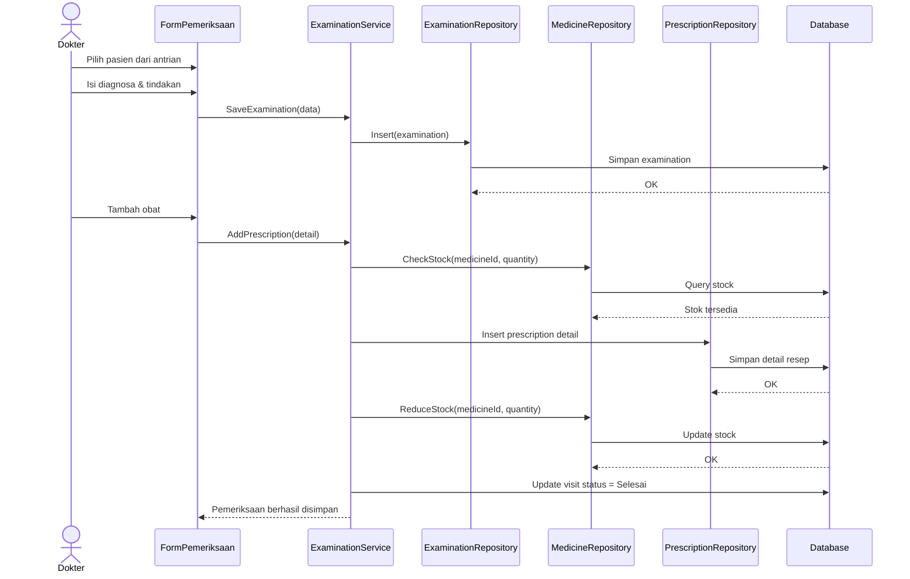
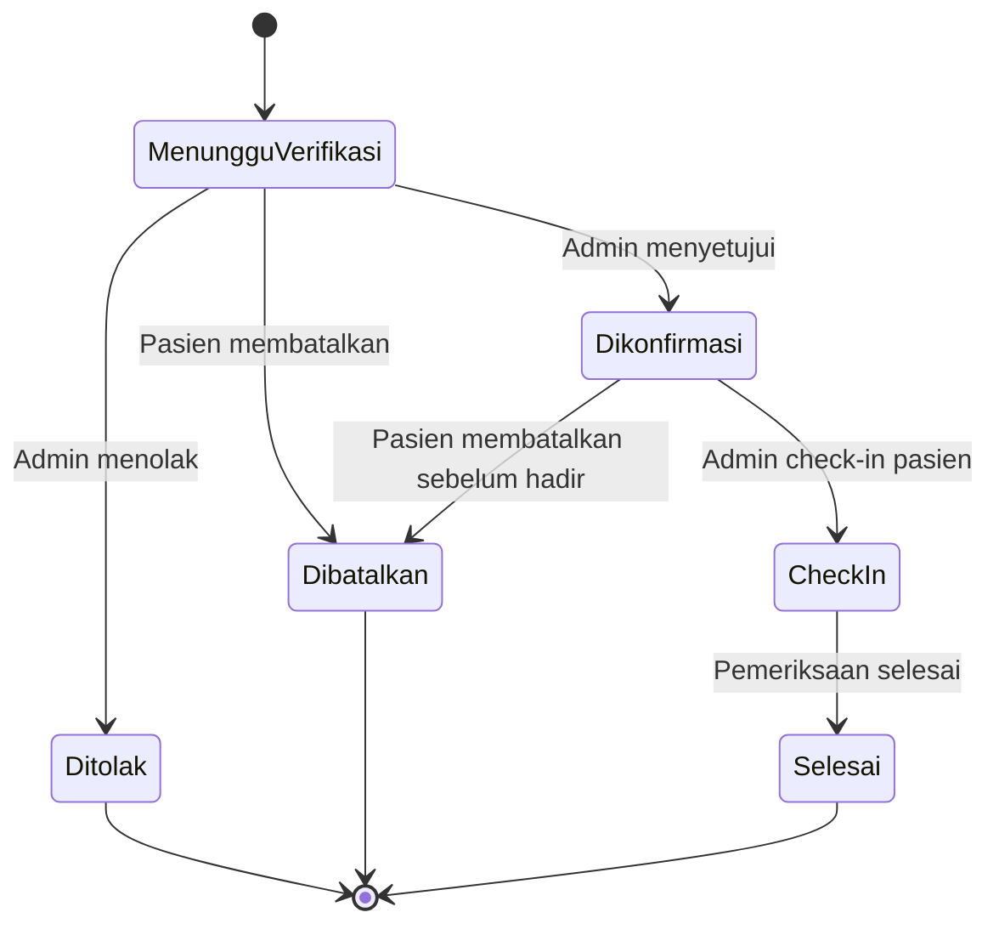

# PRD — Sistem Informasi dan Manajemen Klinik (SIMANIK)

## Desktop App C# (Visual Studio)

> Sistem dirancang untuk dibuat menggunakan **Visual Studio + C#** sebagai **aplikasi desktop**, dengan 3 role utama:
>
> 1. **Admin** _(merangkap front office)_
> 2. **Dokter**
> 3. **Pasien**
>

---

# 1. Ringkasan Produk

## 1.1 Nama Produk

**Sistem dan Manajemen Klinik**

## 1.2 Jenis Produk

Aplikasi desktop manajemen klinik.

## 1.3 Platform dan Teknologi

- **Bahasa:** C#
- **IDE:** Visual Studio
- **UI:** Windows Forms 
- **Database:** SQL Server LocalDB atau SQLite
- **Arsitektur:** Layer sederhana (Forms, Models, Services, Repositories, Helpers)

## 1.4 Tujuan Utama

Membangun sistem klinik yang memungkinkan:

- pasien membuat reservasi digital/online,
- admin/front office mengelola operasional harian,
- dokter memeriksa pasien dan mengisi hasil pemeriksaan,
- seluruh data tersimpan terstruktur dan saling berelasi.

---

# 2. Latar Belakang

Pada banyak klinik kecil, proses berikut masih sering dilakukan secara manual atau setengah manual:

- pendaftaran pasien,
- pengaturan jadwal dokter,
- reservasi kunjungan,
- pencatatan hasil pemeriksaan,
- pemberian obat,
- pencarian riwayat pasien.

Akibatnya:

- data mudah tercecer,
- pencarian data pasien lambat,
- status reservasi tidak jelas,
- antrian kurang tertata,
- riwayat pemeriksaan sulit ditelusuri,
- stok obat sulit dipantau.

Karena itu, dibutuhkan sistem sederhana tetapi tetap lengkap yang dapat:

- memfasilitasi **reservasi digital**,
- mempermudah kerja **front office/admin**,
- mendukung kerja **dokter**,
- memberi pengalaman lebih baik untuk **pasien**.

---

# 3. Visi Produk

Menyediakan aplikasi desktop klinik yang:

- memiliki alur kerja realistis,
- mendukung reservasi digital/online,
- menampilkan pembagian hak akses berdasarkan role,
- menerapkan konsep OOP dengan jelas,
- cukup lengkap untuk presentasi, namun masih realistis untuk dibangun oleh tim mahasiswa.

---

# 4. Tujuan Produk

## 4.1 Tujuan Operasional

- Memudahkan pasien melakukan reservasi secara digital.
- Memudahkan admin/front office memverifikasi reservasi dan mengatur kedatangan pasien.
- Memudahkan dokter melihat jadwal dan pasien yang harus ditangani.
- Menyimpan hasil pemeriksaan dan riwayat pasien dalam satu sistem.
- Menyediakan data obat dan pencatatan obat yang diberikan.

## 4.2 Tujuan Akademik

Menjadi proyek yang kuat untuk menunjukkan:

- **Encapsulation**
- **Inheritance**
- **Polymorphism**
- **Abstraction**
- **Association**
- **Composition**

---

# 5. Ruang Lingkup Sistem

## 5.1 Yang Termasuk dalam Sistem

1. Registrasi akun pasien
2. Login multi-role
3. Dashboard sesuai role
4. Manajemen akun user internal dan pasien
5. Manajemen data dokter
6. Manajemen jadwal dokter
7. Reservasi digital/online
8. Konfirmasi reservasi
9. Registrasi kedatangan pasien
10. Antrian/kunjungan pasien
11. Pemeriksaan pasien
12. Data obat
13. Pemberian obat saat pemeriksaan
14. Riwayat reservasi
15. Riwayat pemeriksaan pasien
16. Laporan sederhana

## 5.2 Yang Tidak Termasuk

1. Pembayaran online
2. Integrasi BPJS
3. Integrasi laboratorium
4. Notifikasi WhatsApp/SMS
5. Tanda tangan digital
6. Multi-cabang klinik
7. Aplikasi mobile native
8. Sinkronisasi cloud publik
9. Telemedicine / video call

> Reservasi disebut **digital/online** karena pasien bisa memesan slot/jadwal secara mandiri lewat sistem sebelum datang ke klinik.  
> Untuk implementasi tugas, modul pasien dapat dibuat sebagai **role pasien** di aplikasi yang sama atau sebagai proyek desktop terpisah yang tetap memakai database yang sama.

---

# 6. Role Pengguna

Sistem memakai **3 role**, sesuai revisi dosen:

## 6.1 Admin (Merangkap Front Office)

Admin/front office bertanggung jawab terhadap operasional administrasi dan manajemen data.

### Tugas Utama Admin

- mengelola akun user
- mengelola data dokter
- mengelola jadwal dokter
- memverifikasi reservasi pasien
- mencatat kedatangan pasien
- mengelola data obat
- memantau antrian
- melihat laporan dan data keseluruhan

## 6.2 Dokter

Dokter bertanggung jawab terhadap pelayanan medis di sistem.

### Tugas Utama Dokter

- melihat daftar pasien hari ini
- melihat detail reservasi/kunjungan
- melihat riwayat pasien
- mengisi hasil pemeriksaan
- menentukan diagnosa
- menambahkan catatan tindakan
- memilih obat yang diberikan
- menyelesaikan pemeriksaan

## 6.3 Pasien

Pasien merupakan pengguna eksternal yang menggunakan sistem untuk reservasi dan melihat datanya sendiri.

### Tugas Utama Pasien

- registrasi akun
- login
- mengelola profil
- melihat jadwal dokter
- membuat reservasi digital/online
- melihat status reservasi
- membatalkan reservasi
- melihat riwayat reservasi
- melihat riwayat pemeriksaan sederhana

---

# 7. Matriks Hak Akses

| Fitur                         | Admin | Dokter   | Pasien          |
| ----------------------------- | ----- | -------- | --------------- |
| Registrasi akun pasien        | Tidak | Tidak    | Ya              |
| Login                         | Ya    | Ya       | Ya              |
| Dashboard                     | Ya    | Ya       | Ya              |
| Kelola akun user              | Ya    | Tidak    | Tidak           |
| Kelola data dokter            | Ya    | Tidak    | Tidak           |
| Kelola jadwal dokter          | Ya    | Tidak    | Tidak           |
| Lihat jadwal dokter           | Ya    | Ya       | Ya              |
| Kelola data obat              | Ya    | Tidak    | Tidak           |
| Buat reservasi online         | Tidak | Tidak    | Ya              |
| Lihat reservasi sendiri       | Tidak | Tidak    | Ya              |
| Batalkan reservasi sendiri    | Tidak | Tidak    | Ya              |
| Lihat semua reservasi         | Ya    | Tidak    | Tidak           |
| Verifikasi reservasi          | Ya    | Tidak    | Tidak           |
| Registrasi kedatangan pasien  | Ya    | Tidak    | Tidak           |
| Lihat antrian hari ini        | Ya    | Ya       | Tidak           |
| Lihat detail pasien           | Ya    | Ya       | Pasien sendiri  |
| Isi hasil pemeriksaan         | Tidak | Ya       | Tidak           |
| Tambahkan obat ke pemeriksaan | Tidak | Ya       | Tidak           |
| Lihat riwayat pasien          | Ya    | Ya       | Riwayat sendiri |
| Lihat laporan                 | Ya    | Terbatas | Tidak           |

---

# 8. Gambaran Umum Alur Sistem

Alur besar sistem adalah:

1. Pasien melakukan registrasi akun
2. Pasien login
3. Pasien melihat jadwal dokter
4. Pasien membuat reservasi online
5. Admin memverifikasi reservasi
6. Saat pasien datang, admin mengubah status menjadi hadir/check-in
7. Dokter melihat antrian pasien hari itu
8. Dokter membuka data pasien dan riwayat sebelumnya
9. Dokter mengisi hasil pemeriksaan
10. Dokter memilih obat yang diberikan
11. Sistem menyimpan data pemeriksaan, resep, dan riwayat
12. Admin dapat melihat laporan operasional sederhana

---

# 9. Fitur Utama Sistem

## 9.1 Registrasi dan Login

Fitur untuk autentikasi user.

### Subfitur

- registrasi akun pasien
- login semua role
- logout
- validasi username/password
- pembacaan role dan pengalihan ke dashboard yang sesuai

## 9.2 Dashboard Berdasarkan Role

### Dashboard Admin

Menampilkan:

- total pasien
- total dokter
- total reservasi hari ini
- total pasien check-in
- total pemeriksaan selesai
- stok obat rendah

### Dashboard Dokter

Menampilkan:

- jadwal praktik hari ini
- daftar pasien hari ini
- jumlah pasien menunggu
- jumlah pemeriksaan selesai

### Dashboard Pasien

Menampilkan:

- profil singkat
- reservasi terdekat
- status reservasi terakhir
- riwayat kunjungan terakhir

## 9.3 Manajemen Akun

Digunakan admin untuk mengelola akun user internal dan memantau akun pasien.

### Subfitur

- tambah akun admin/dokter
- ubah akun
- nonaktifkan akun
- lihat daftar user
- cari user

> Akun pasien dapat dibuat mandiri oleh pasien melalui registrasi.

## 9.4 Manajemen Data Dokter

Digunakan admin untuk menyimpan dan mengatur dokter.

### Subfitur

- tambah dokter
- ubah dokter
- hapus/nonaktifkan dokter
- cari dokter
- lihat detail dokter

### Data Dokter

- ID Dokter
- Nama
- Spesialisasi
- Nomor telepon
- Status aktif

## 9.5 Manajemen Jadwal Dokter

Digunakan admin untuk mengatur jadwal praktik dokter.

### Subfitur

- tambah jadwal
- ubah jadwal
- hapus jadwal
- melihat slot yang tersedia
- menentukan kuota maksimal pasien per jadwal

### Data Jadwal

- ID Jadwal
- Dokter
- Hari/Tanggal
- Jam mulai
- Jam selesai
- Kuota pasien
- Status aktif

## 9.6 Profil Pasien

Digunakan pasien untuk melengkapi identitas.

### Subfitur

- lihat profil
- ubah profil
- ubah nomor telepon
- ubah alamat
- lihat nomor rekam pasien sederhana

### Data Pasien

- ID Pasien
- User akun
- Nama lengkap
- Tanggal lahir
- Jenis kelamin
- Alamat
- Nomor telepon

## 9.7 Reservasi Digital/Online

Fitur utama untuk pasien membuat reservasi sebelum datang.

### Subfitur

- melihat daftar dokter
- melihat jadwal dokter
- memilih tanggal/jadwal
- memilih keluhan awal
- membuat reservasi
- melihat status reservasi
- membatalkan reservasi selama belum check-in

### Status Reservasi

- Menunggu Verifikasi
- Dikonfirmasi
- Ditolak
- Dibatalkan Pasien
- Check-in
- Selesai

## 9.8 Verifikasi Reservasi

Digunakan admin/front office untuk memproses reservasi masuk.

### Subfitur

- lihat daftar reservasi baru
- konfirmasi reservasi
- tolak reservasi
- ubah jadwal bila diperlukan
- lihat alasan pembatalan/penolakan
- registrasi check-in saat pasien datang

## 9.9 Kunjungan / Antrian

Merupakan data operasional pasien yang benar-benar datang dan akan diperiksa.

### Subfitur

- buat kunjungan dari reservasi yang sudah check-in
- nomor antrian sederhana
- status kunjungan
- daftar pasien menunggu
- daftar pasien diperiksa
- daftar pasien selesai

### Status Kunjungan

- Menunggu
- Sedang Diperiksa
- Selesai

## 9.10 Pemeriksaan Pasien

Digunakan dokter saat melayani pasien.

### Subfitur

- lihat daftar pasien antrian
- buka detail pasien
- lihat riwayat pemeriksaan sebelumnya
- isi keluhan saat ini
- isi diagnosa
- isi catatan/tindakan
- simpan pemeriksaan
- selesaikan kunjungan

### Data Pemeriksaan

- ID Pemeriksaan
- Kunjungan
- Dokter
- Tanggal pemeriksaan
- Keluhan
- Diagnosa
- Catatan tindakan

## 9.11 Manajemen Obat

Digunakan admin untuk menyimpan master data obat.

### Subfitur

- tambah obat
- ubah obat
- hapus/nonaktifkan obat
- cari obat
- lihat stok obat
- lihat obat hampir habis

### Data Obat

- ID Obat
- Nama obat
- Jenis
- Stok
- Satuan
- Aturan pakai default

## 9.12 Resep / Obat yang Diberikan

Digunakan dokter saat selesai memeriksa pasien.

### Subfitur

- pilih obat
- isi jumlah
- isi aturan pakai
- tambah lebih dari satu obat
- validasi stok
- pengurangan stok otomatis

## 9.13 Riwayat

### Riwayat untuk Pasien

- riwayat reservasi sendiri
- riwayat pemeriksaan sendiri
- ringkasan obat yang pernah diberikan

### Riwayat untuk Dokter

- riwayat pasien yang pernah diperiksa
- pemeriksaan sebelumnya

### Riwayat untuk Admin

- semua reservasi
- semua pemeriksaan
- data kunjungan per periode

## 9.14 Laporan Sederhana

Digunakan admin untuk monitoring.

### Laporan yang Disarankan

- reservasi per hari
- reservasi per dokter
- kunjungan selesai per hari
- jumlah pasien per dokter
- obat yang paling sering diberikan
- stok obat menipis

> Laporan cukup berupa grid/table/filter sederhana pada Windows Forms.  
> Tidak wajib ekspor PDF agar scope tetap realistis.

---

# 10. Use Case Utama

## 10.1 Use Case List

1. Registrasi akun pasien
2. Login
3. Kelola akun
4. Kelola dokter
5. Kelola jadwal dokter
6. Kelola data obat
7. Kelola profil pasien
8. Buat reservasi online
9. Verifikasi reservasi
10. Check-in pasien
11. Lihat antrian pasien
12. Isi hasil pemeriksaan
13. Tambah obat ke pemeriksaan
14. Lihat riwayat
15. Lihat laporan

---

# 11. Diagram Use Case



---

# 12. Alur Kerja Sistem

## 12.1 Alur Reservasi Pasien

1. Pasien registrasi akun
2. Pasien login
3. Pasien melihat jadwal dokter
4. Pasien memilih jadwal
5. Pasien mengisi keluhan awal
6. Sistem menyimpan reservasi dengan status **Menunggu Verifikasi**
7. Admin melihat reservasi masuk
8. Admin menyetujui atau menolak reservasi
9. Jika disetujui, status menjadi **Dikonfirmasi**
10. Saat pasien datang, admin melakukan **check-in**
11. Reservasi diteruskan ke data kunjungan/antrian

## 12.2 Alur Pemeriksaan

1. Dokter login
2. Dokter melihat daftar pasien yang sudah check-in
3. Dokter membuka data pasien
4. Dokter melihat riwayat sebelumnya
5. Dokter mengisi hasil pemeriksaan
6. Dokter menambahkan obat yang diberikan
7. Sistem memvalidasi stok obat
8. Sistem menyimpan pemeriksaan
9. Sistem mengurangi stok obat
10. Status kunjungan menjadi **Selesai**

## 12.3 Alur Laporan

1. Admin login
2. Admin membuka menu laporan
3. Admin memilih filter tanggal/dokter
4. Sistem menampilkan data reservasi, kunjungan, atau obat
5. Admin melihat hasil dalam tabel

---

# 13. Diagram Aktivitas Reservasi Online



---

# 14. Diagram Aktivitas Pemeriksaan



---

# 15. Kebutuhan Fungsional

## 15.1 Modul Registrasi

- Sistem harus memungkinkan pasien membuat akun baru.
- Sistem harus memvalidasi username unik.
- Sistem harus menyimpan akun dengan role **Pasien**.

## 15.2 Modul Login

- Sistem harus menerima username dan password.
- Sistem harus memvalidasi kredensial user.
- Sistem harus mengarahkan ke dashboard sesuai role.
- Sistem harus menolak login yang salah.

## 15.3 Modul Akun

- Admin dapat menambah akun admin dan dokter.
- Admin dapat mengubah status aktif/nonaktif akun.
- Admin dapat melihat daftar seluruh akun.

## 15.4 Modul Dokter

- Admin dapat menambah, ubah, dan nonaktifkan data dokter.
- Sistem harus menampilkan daftar dokter aktif.
- Sistem harus menyimpan spesialisasi dokter.

## 15.5 Modul Jadwal Dokter

- Admin dapat menambah jadwal dokter.
- Sistem harus menyimpan kuota pasien pada tiap jadwal.
- Pasien dapat melihat jadwal dokter yang aktif.
- Reservasi hanya boleh dibuat pada jadwal aktif.

## 15.6 Modul Profil Pasien

- Pasien dapat melihat dan memperbarui profilnya.
- Sistem harus mengaitkan akun pasien dengan data pasien.

## 15.7 Modul Reservasi

- Pasien dapat membuat reservasi.
- Reservasi harus terhubung ke pasien dan jadwal dokter.
- Sistem harus menyimpan keluhan awal.
- Pasien dapat membatalkan reservasi sebelum check-in.
- Admin dapat memverifikasi reservasi.

## 15.8 Modul Kunjungan

- Reservasi yang sudah check-in harus menjadi data kunjungan.
- Sistem harus menyimpan nomor antrian sederhana.
- Sistem harus menampilkan daftar antrian.

## 15.9 Modul Pemeriksaan

- Dokter dapat memilih kunjungan aktif.
- Dokter dapat menyimpan diagnosa dan catatan tindakan.
- Pemeriksaan harus terhubung ke kunjungan.

## 15.10 Modul Obat dan Resep

- Dokter dapat memilih lebih dari satu obat pada pemeriksaan.
- Sistem harus memvalidasi stok obat.
- Sistem harus mengurangi stok setelah resep disimpan.
- Sistem harus menyimpan aturan pakai pada detail resep.

## 15.11 Modul Riwayat

- Pasien dapat melihat riwayat miliknya sendiri.
- Dokter dapat melihat riwayat pasien yang sedang diperiksa.
- Admin dapat melihat seluruh riwayat reservasi dan pemeriksaan.

## 15.12 Modul Laporan

- Admin dapat melihat laporan reservasi berdasarkan periode.
- Admin dapat melihat jumlah pemeriksaan per dokter.
- Admin dapat melihat obat dengan stok rendah.

---

# 16. Kebutuhan Non-Fungsional

- Sistem berjalan pada Windows.
- Tampilan sederhana, rapi, dan konsisten.
- Database lokal harus stabil untuk CRUD.
- Hak akses role harus berjalan.
- Waktu respon pencarian data harus cepat.
- Data wajib tervalidasi sebelum disimpan.
- Struktur proyek harus mudah dibagi ke anggota kelompok.
- Warna UI menggunakan tone biru muda agar terlihat bersih dan profesional.

---

# 17. Aturan Bisnis

1. Setiap akun hanya memiliki satu role.
2. Role sistem adalah: Admin, Dokter, dan Pasien.
3. Hanya pasien yang bisa membuat reservasi online.
4. Reservasi hanya dapat dibuat pada jadwal dokter yang aktif.
5. Reservasi harus diverifikasi admin sebelum dianggap valid.
6. Pasien yang tidak diverifikasi tidak masuk antrian.
7. Pasien yang sudah check-in akan berubah menjadi data kunjungan aktif.
8. Pemeriksaan hanya dapat dilakukan untuk kunjungan yang aktif.
9. Hanya dokter yang dapat mengisi hasil pemeriksaan.
10. Obat hanya dapat ditambahkan pada pemeriksaan yang sedang dibuat.
11. Stok obat harus cukup sebelum resep disimpan.
12. Setelah resep tersimpan, stok obat berkurang.
13. Pasien hanya dapat melihat data miliknya sendiri.
14. Admin dapat melihat semua data operasional.
15. Dokter dapat melihat data pasien yang relevan untuk pemeriksaan.

---

# 18. Validasi Data

- Username tidak boleh kosong.
- Password tidak boleh kosong.
- Username harus unik.
- Nama pasien wajib diisi.
- Tanggal lahir harus valid.
- Nomor telepon harus valid.
- Jadwal dokter harus aktif agar bisa dipilih.
- Kuota jadwal tidak boleh terlampaui.
- Keluhan awal tidak boleh kosong saat reservasi.
- Diagnosa tidak boleh kosong saat pemeriksaan disimpan.
- Jumlah obat harus lebih dari 0.
- Jumlah obat tidak boleh melebihi stok.
- Pasien tidak boleh check-in jika reservasi belum dikonfirmasi.

---

# 19. Use Case Specification

## 19.1 Use Case — Registrasi Pasien

| Elemen     | Deskripsi                                                                                                                                          |
| ---------- | -------------------------------------------------------------------------------------------------------------------------------------------------- |
| Nama       | Registrasi Pasien                                                                                                                                  |
| Aktor      | Pasien                                                                                                                                             |
| Tujuan     | Membuat akun pasien baru                                                                                                                           |
| Prasyarat  | Belum memiliki akun                                                                                                                                |
| Alur Utama | 1. Pasien membuka form registrasi. 2. Pasien mengisi data akun dan profil. 3. Sistem memvalidasi data. 4. Sistem menyimpan akun dan profil pasien. |
| Hasil      | Akun pasien berhasil dibuat                                                                                                                        |

## 19.2 Use Case — Buat Reservasi Online

| Elemen     | Deskripsi                                                                                                                                          |
| ---------- | -------------------------------------------------------------------------------------------------------------------------------------------------- |
| Nama       | Buat Reservasi Online                                                                                                                              |
| Aktor      | Pasien                                                                                                                                             |
| Tujuan     | Memesan slot pemeriksaan sebelum datang ke klinik                                                                                                  |
| Prasyarat  | Pasien login, jadwal dokter tersedia                                                                                                               |
| Alur Utama | 1. Pasien membuka jadwal dokter. 2. Memilih jadwal. 3. Mengisi keluhan awal. 4. Menyimpan reservasi. 5. Sistem memberi status Menunggu Verifikasi. |
| Hasil      | Reservasi tersimpan                                                                                                                                |

## 19.3 Use Case — Verifikasi Reservasi

| Elemen     | Deskripsi                                                                                                                                      |
| ---------- | ---------------------------------------------------------------------------------------------------------------------------------------------- |
| Nama       | Verifikasi Reservasi                                                                                                                           |
| Aktor      | Admin                                                                                                                                          |
| Tujuan     | Menyetujui atau menolak reservasi pasien                                                                                                       |
| Prasyarat  | Reservasi masuk tersedia                                                                                                                       |
| Alur Utama | 1. Admin membuka daftar reservasi. 2. Admin meninjau detail reservasi. 3. Admin memilih setujui/tolak. 4. Sistem memperbarui status reservasi. |
| Hasil      | Status reservasi berubah                                                                                                                       |

## 19.4 Use Case — Check-in Pasien

| Elemen     | Deskripsi                                                                                                             |
| ---------- | --------------------------------------------------------------------------------------------------------------------- |
| Nama       | Check-in Pasien                                                                                                       |
| Aktor      | Admin                                                                                                                 |
| Tujuan     | Mendaftarkan pasien hadir di klinik                                                                                   |
| Prasyarat  | Reservasi sudah dikonfirmasi                                                                                          |
| Alur Utama | 1. Admin memilih reservasi terkonfirmasi. 2. Admin menekan tombol check-in. 3. Sistem membuat data kunjungan/antrian. |
| Hasil      | Pasien masuk daftar antrian                                                                                           |

## 19.5 Use Case — Isi Pemeriksaan

| Elemen     | Deskripsi                                                                                                                               |
| ---------- | --------------------------------------------------------------------------------------------------------------------------------------- |
| Nama       | Isi Pemeriksaan                                                                                                                         |
| Aktor      | Dokter                                                                                                                                  |
| Tujuan     | Menyimpan hasil pemeriksaan pasien                                                                                                      |
| Prasyarat  | Pasien sudah check-in dan masuk antrian                                                                                                 |
| Alur Utama | 1. Dokter memilih pasien. 2. Dokter melihat data dan riwayat. 3. Dokter mengisi diagnosa dan tindakan. 4. Dokter menyimpan pemeriksaan. |
| Hasil      | Pemeriksaan tersimpan                                                                                                                   |

## 19.6 Use Case — Tambah Obat ke Pemeriksaan

| Elemen     | Deskripsi                                                                                                                                           |
| ---------- | --------------------------------------------------------------------------------------------------------------------------------------------------- |
| Nama       | Tambah Obat ke Pemeriksaan                                                                                                                          |
| Aktor      | Dokter                                                                                                                                              |
| Tujuan     | Menambahkan obat yang diberikan kepada pasien                                                                                                       |
| Prasyarat  | Pemeriksaan sedang dibuat, stok obat tersedia                                                                                                       |
| Alur Utama | 1. Dokter memilih obat. 2. Dokter mengisi jumlah dan aturan pakai. 3. Sistem memvalidasi stok. 4. Sistem menyimpan detail obat dan mengurangi stok. |
| Hasil      | Obat tersimpan pada pemeriksaan                                                                                                                     |

## 19.7 Use Case — Lihat Riwayat

| Elemen     | Deskripsi                                                                                           |
| ---------- | --------------------------------------------------------------------------------------------------- |
| Nama       | Lihat Riwayat                                                                                       |
| Aktor      | Admin, Dokter, Pasien                                                                               |
| Tujuan     | Melihat riwayat yang relevan sesuai hak akses                                                       |
| Prasyarat  | Data riwayat tersedia                                                                               |
| Alur Utama | 1. Pengguna membuka menu riwayat. 2. Sistem menampilkan daftar riwayat. 3. Pengguna membuka detail. |
| Hasil      | Riwayat dapat dilihat                                                                               |

---

# 20. Desain Database

## Minimal 5 tabel berelasi — versi ini menggunakan **9 tabel berelasi**

Agar seluruh fitur benar-benar bisa “jalan semua” secara logis, berikut struktur database yang disarankan.

## Daftar Tabel

1. `users`
2. `patients`
3. `doctors`
4. `doctor_schedules`
5. `reservations`
6. `visits`
7. `examinations`
8. `medicines`
9. `prescription_details`

## 20.1 Tabel `users`

Menyimpan akun login semua role.

Kolom:

- `UserId` (PK)
- `Username`
- `Password`
- `Role`
- `IsActive`
- `CreatedAt`

### Role pada users

- Admin
- Dokter
- Pasien

## 20.2 Tabel `patients`

Menyimpan profil pasien.

Kolom:

- `PatientId` (PK)
- `UserId` (FK ke users)
- `FullName`
- `BirthDate`
- `Gender`
- `Address`
- `PhoneNumber`

> Relasi ini memungkinkan pasien login dengan role Pasien, sekaligus punya data profil terpisah yang lebih lengkap.

## 20.3 Tabel `doctors`

Menyimpan profil dokter.

Kolom:

- `DoctorId` (PK)
- `UserId` (FK ke users)
- `FullName`
- `Specialization`
- `PhoneNumber`
- `IsActive`

> Dokter juga punya akun login sehingga dihubungkan ke `users`.

## 20.4 Tabel `doctor_schedules`

Menyimpan jadwal praktik dokter.

Kolom:

- `ScheduleId` (PK)
- `DoctorId` (FK ke doctors)
- `ScheduleDate`
- `StartTime`
- `EndTime`
- `Quota`
- `IsActive`

## 20.5 Tabel `reservations`

Menyimpan reservasi online dari pasien.

Kolom:

- `ReservationId` (PK)
- `PatientId` (FK ke patients)
- `ScheduleId` (FK ke doctor_schedules)
- `Complaint`
- `ReservationStatus`
- `CreatedAt`

## 20.6 Tabel `visits`

Menyimpan data kunjungan/check-in pasien yang benar-benar datang.

Kolom:

- `VisitId` (PK)
- `ReservationId` (FK ke reservations, nullable bila ingin dukung walk-in di masa depan)
- `QueueNumber`
- `CheckInTime`
- `VisitStatus`

> Walaupun fokus utama reservasi online, tabel `visits` penting agar proses operasional hari H tetap terpisah dari reservasi.

## 20.7 Tabel `examinations`

Menyimpan hasil pemeriksaan dokter.

Kolom:

- `ExaminationId` (PK)
- `VisitId` (FK ke visits)
- `DoctorId` (FK ke doctors)
- `ExaminationDate`
- `CurrentComplaint`
- `Diagnosis`
- `TreatmentNotes`

## 20.8 Tabel `medicines`

Menyimpan master data obat.

Kolom:

- `MedicineId` (PK)
- `MedicineName`
- `MedicineType`
- `Stock`
- `Unit`
- `DefaultInstruction`
- `IsActive`

## 20.9 Tabel `prescription_details`

Menyimpan detail obat yang diberikan pada suatu pemeriksaan.

Kolom:

- `PrescriptionDetailId` (PK)
- `ExaminationId` (FK ke examinations)
- `MedicineId` (FK ke medicines)
- `Quantity`
- `InstructionNote`

---

# 21. ERD



---

# 22. OOP Design

Sistem ini sangat cocok untuk pendekatan OOP karena setiap entitas penting pada dunia nyata bisa direpresentasikan menjadi object.

## 22.1 Encapsulation

Encapsulation digunakan untuk membungkus data dan membatasi perubahan langsung.

### Contoh

- `Stock` pada class `Medicine` tidak boleh negatif.
- `ReservationStatus` pada `Reservation` hanya boleh berisi status yang valid.
- `Quantity` pada resep tidak boleh nol atau negatif.

## 22.2 Inheritance

Inheritance digunakan untuk menghindari duplikasi atribut.

### Pendekatan yang Disarankan

Gunakan dua level inheritance yang sederhana:

#### A. Untuk akun login

- `UserAccount` _(abstract)_
- `Admin : UserAccount`
- `DoctorAccount : UserAccount`
- `PatientAccount : UserAccount`

#### B. Untuk profil manusia

- `Person` _(abstract)_
- `DoctorProfile : Person`
- `PatientProfile : Person`

Dengan ini:

- atribut umum seperti `Username`, `Password`, `Role` diletakkan di `UserAccount`
- atribut umum seperti `FullName`, `PhoneNumber`, `Address` diletakkan di `Person`

## 22.3 Polymorphism

Polymorphism digunakan ketika method yang sama menghasilkan perilaku berbeda pada subclass.

### Contoh

- `GetDashboardMenu()` pada `Admin`, `DoctorAccount`, dan `PatientAccount`
- `GetRoleName()` pada tiap turunan `UserAccount`

## 22.4 Abstraction

Abstraction digunakan melalui:

- abstract class,
- interface service/repository.

### Contoh interface

- `ICrudService<T>`
- `IRepository<T>`
- `IAuthService`
- `IReservationService`

## 22.5 Association

Association tampak pada relasi:

- pasien membuat banyak reservasi,
- dokter punya banyak jadwal,
- dokter menangani banyak pemeriksaan,
- pemeriksaan berhubungan dengan kunjungan dan obat.

## 22.6 Composition

Composition tampak pada:

- `Examination` memiliki kumpulan `PrescriptionDetail`
- tanpa pemeriksaan, detail resep tidak bermakna

---

# 23. Daftar Class Utama

## 23.1 UserAccount (Abstract)

Atribut:

- Id
- Username
- Password
- Role
- IsActive

Method:

- `GetRoleName()`
- `CanAccess(featureName)`

## 23.2 Admin : UserAccount

Method:

- `GetDashboardMenu()`

## 23.3 DoctorAccount : UserAccount

Method:

- `GetDashboardMenu()`

## 23.4 PatientAccount : UserAccount

Method:

- `GetDashboardMenu()`

## 23.5 Person (Abstract)

Atribut:

- FullName
- PhoneNumber
- Address

Method:

- `GetDisplayInfo()`

## 23.6 DoctorProfile : Person

Atribut tambahan:

- Specialization

Method:

- `GetDisplayInfo()`

## 23.7 PatientProfile : Person

Atribut tambahan:

- BirthDate
- Gender

Method:

- `CalculateAge()`

## 23.8 DoctorSchedule

Atribut:

- ScheduleId
- Doctor
- ScheduleDate
- StartTime
- EndTime
- Quota
- IsActive

Method:

- `IsSlotAvailable()`

## 23.9 Reservation

Atribut:

- ReservationId
- Patient
- Schedule
- Complaint
- ReservationStatus
- CreatedAt

Method:

- `Confirm()`
- `Reject()`
- `CancelByPatient()`
- `CheckIn()`

## 23.10 Visit

Atribut:

- VisitId
- Reservation
- QueueNumber
- CheckInTime
- VisitStatus

Method:

- `StartExamination()`
- `FinishVisit()`

## 23.11 Examination

Atribut:

- ExaminationId
- Visit
- Doctor
- ExaminationDate
- CurrentComplaint
- Diagnosis
- TreatmentNotes
- List<PrescriptionDetail>

Method:

- `AddPrescription()`
- `SaveResult()`

## 23.12 Medicine

Atribut:

- MedicineId
- MedicineName
- MedicineType
- Stock
- Unit
- DefaultInstruction

Method:

- `ReduceStock(int qty)`
- `AddStock(int qty)`

## 23.13 PrescriptionDetail

Atribut:

- PrescriptionDetailId
- Examination
- Medicine
- Quantity
- InstructionNote

Method:

- `ValidateQuantity()`

---

# 24. Diagram Class



---

# 25. Diagram Sequence — Reservasi Online



---

# 26. Diagram Sequence — Verifikasi dan Check-in



---

# 27. Diagram Sequence — Pemeriksaan dan Resep



---

# 28. Diagram Status Reservasi



---

# 29. Struktur Arsitektur yang Disarankan

```text
KlinikSehat/
├── Forms/
│   ├── FormLogin.cs
│   ├── FormRegisterPatient.cs
│   ├── FormDashboardAdmin.cs
│   ├── FormDashboardDoctor.cs
│   ├── FormDashboardPatient.cs
│   ├── FormUsers.cs
│   ├── FormDoctors.cs
│   ├── FormDoctorSchedules.cs
│   ├── FormPatients.cs
│   ├── FormReservations.cs
│   ├── FormCheckIn.cs
│   ├── FormQueues.cs
│   ├── FormExaminations.cs
│   ├── FormMedicines.cs
│   ├── FormHistory.cs
│   └── FormReports.cs
├── Models/
│   ├── UserAccount.cs
│   ├── Admin.cs
│   ├── DoctorAccount.cs
│   ├── PatientAccount.cs
│   ├── Person.cs
│   ├── DoctorProfile.cs
│   ├── PatientProfile.cs
│   ├── DoctorSchedule.cs
│   ├── Reservation.cs
│   ├── Visit.cs
│   ├── Examination.cs
│   ├── Medicine.cs
│   └── PrescriptionDetail.cs
├── Services/
│   ├── AuthService.cs
│   ├── UserService.cs
│   ├── DoctorService.cs
│   ├── ScheduleService.cs
│   ├── PatientService.cs
│   ├── ReservationService.cs
│   ├── VisitService.cs
│   ├── ExaminationService.cs
│   ├── MedicineService.cs
│   └── ReportService.cs
├── Repositories/
│   ├── IRepository.cs
│   ├── UserRepository.cs
│   ├── DoctorRepository.cs
│   ├── ScheduleRepository.cs
│   ├── PatientRepository.cs
│   ├── ReservationRepository.cs
│   ├── VisitRepository.cs
│   ├── ExaminationRepository.cs
│   ├── MedicineRepository.cs
│   └── PrescriptionRepository.cs
├── Helpers/
│   ├── DatabaseHelper.cs
│   ├── SessionHelper.cs
│   ├── ValidationHelper.cs
│   └── QueueHelper.cs
└── Program.cs
```

---

# 30. Desain Tampilan UI

Karena kamu menginginkan tampilan dengan warna yang **satu tone dengan biru muda**, maka tema visual yang disarankan adalah:

## 30.1 Konsep UI

- bersih
- modern
- ringan
- tidak terlalu ramai
- nyaman untuk aplikasi kesehatan

## 30.2 Rekomendasi Palet Warna

- **Primary:** `#004BCD` _(biru muda utama)_
- **Secondary:** `#79AAFF`
- **Accent:** `#D6F1FA`
- **Background:** `#F4FBFE`
- **Card / Panel:** `#EAF7FC`
- **Text utama:** `#072A38`
- **Text sekunder:** `#4C7382`

## 30.3 Saran Implementasi Visual

- gunakan navbar/sidebar biru muda lembut
- gunakan panel putih kebiruan
- gunakan tombol utama dengan biru muda yang sedikit lebih gelap
- gunakan ikon sederhana
- gunakan font yang bersih seperti **Segoe UI**
- gunakan data grid dengan header biru muda

## 30.4 Kesan yang Ingin Dicapai

- profesional
- ramah
- bersih
- cocok untuk tema kesehatan

---

# 31. Pembagian Tugas untuk 4 Orang

## Anggota 1 — Login, Session, Akun, Dashboard

Fokus:

- form login
- registrasi pasien
- session management
- dashboard per role
- manajemen akun

Class utama:

- `UserAccount`
- `Admin`
- `DoctorAccount`
- `PatientAccount`
- `AuthService`

## Anggota 2 — Dokter dan Jadwal

Fokus:

- CRUD dokter
- CRUD jadwal dokter
- daftar jadwal dokter
- validasi kuota jadwal

Class utama:

- `DoctorProfile`
- `DoctorSchedule`
- `DoctorService`
- `ScheduleService`

## Anggota 3 — Pasien dan Reservasi

Fokus:

- profil pasien
- reservasi online
- verifikasi reservasi
- check-in dan antrian

Class utama:

- `PatientProfile`
- `Reservation`
- `Visit`
- `ReservationService`
- `VisitService`

## Anggota 4 — Pemeriksaan, Obat, Riwayat, Laporan

Fokus:

- pemeriksaan pasien
- resep/detail obat
- pengurangan stok
- riwayat
- laporan

Class utama:

- `Examination`
- `Medicine`
- `PrescriptionDetail`
- `ExaminationService`
- `MedicineService`
- `ReportService`

---

# 32. Skenario Demo Presentasi

Urutan demo yang direkomendasikan:

## Skenario 1 — Pasien

1. Registrasi akun pasien
2. Login sebagai pasien
3. Lihat jadwal dokter
4. Buat reservasi online
5. Lihat status reservasi

## Skenario 2 — Admin

6. Login sebagai admin
7. Lihat reservasi masuk
8. Konfirmasi reservasi
9. Lakukan check-in saat pasien datang
10. Tampilkan antrian pasien

## Skenario 3 — Dokter

11. Login sebagai dokter
12. Lihat daftar pasien hari ini
13. Buka riwayat pasien
14. Isi hasil pemeriksaan
15. Tambahkan obat
16. Simpan pemeriksaan

## Skenario 4 — Hasil Akhir

17. Login lagi sebagai pasien
18. Lihat riwayat pemeriksaan
19. Login sebagai admin
20. Lihat laporan reservasi dan stok obat

> Urutan ini sangat bagus untuk presentasi karena memperlihatkan end-to-end system:
> **pasien reservasi → admin verifikasi → dokter periksa → sistem menyimpan riwayat**.

---

# 33. Risiko dan Solusi

## Risiko

- terlalu banyak modul jika tidak direncanakan
- relasi database membingungkan
- role access bisa keliru
- logika status reservasi dan kunjungan bisa bertabrakan
- update stok obat bisa terlewat

## Solusi

- kunci desain database sejak awal
- buat enum/status yang konsisten
- pisahkan service layer dari form
- buat role checking di satu helper/service
- integrasi modul dilakukan bertahap sesuai alur utama
- prioritaskan fitur inti sebelum polishing tampilan

---

# 34. Kesimpulan

Sistem **KlinikSehat** versi ini sudah memenuhi kebutuhan revisi dosen karena:

- memiliki **3 role** yang jelas: **Admin**, **Dokter**, dan **Pasien**
- mendukung **reservasi digital/online**
- memakai **minimal 5 tabel berelasi**, dan pada desain ini menggunakan **9 tabel berelasi**
- memiliki fitur yang saling terhubung dan logis untuk benar-benar diimplementasikan
- tetap realistis untuk tugas kelompok berbasis **Visual Studio + C#**
- sangat kuat untuk menunjukkan konsep **OOP**

## Nilai Tambah Dokumen Ini

- ada use case
- ada activity diagram
- ada sequence diagram
- ada class diagram
- ada ERD
- ada rekomendasi UI tema biru muda
- ada pembagian tugas tim
- ada alur sistem end-to-end

---

# 35. Rekomendasi Implementasi Bertahap

Agar proyek lebih aman dikerjakan, urutan implementasi yang disarankan adalah:

1. buat database dan seluruh tabel relasi terlebih dahulu
2. buat model class sesuai tabel
3. buat login dan role-based dashboard
4. buat master data dokter, jadwal, dan obat
5. buat registrasi dan profil pasien
6. buat reservasi online
7. buat verifikasi reservasi dan check-in
8. buat pemeriksaan dan resep
9. buat riwayat
10. buat laporan
11. rapikan tampilan tema biru muda

> Dengan urutan ini, semua fitur akan lebih mudah diuji satu per satu sampai seluruh sistem benar-benar “jalan semua”.
